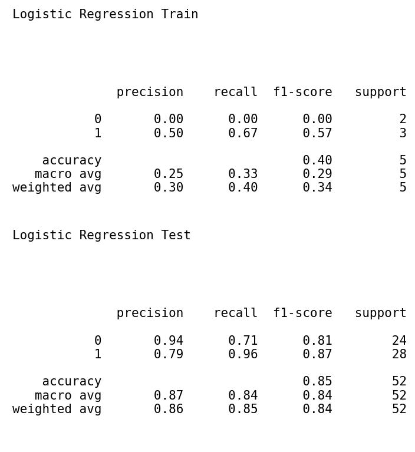
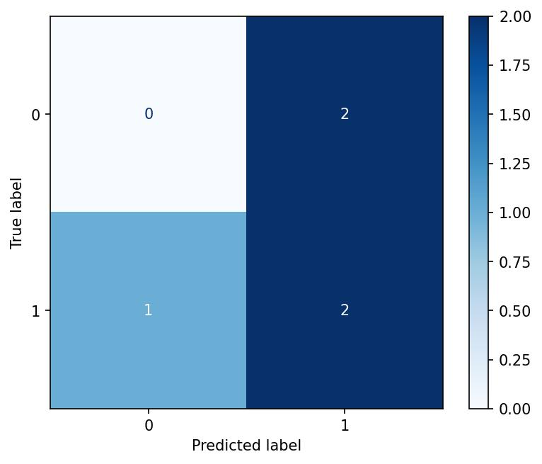

# Beryl 
## Model serving and monitoring

##  <a name='Overview'></a>Overview
This project builds a simple machine learning system to help a company predict and monitor their customers' attrition risks. The system is served as a REST API that exposes a number of endpoints, the most important of which are the `prediction` and `diagnostic` endpoints by which the the system is used and monitored, respectively. A cronjob is also set up to ensure that a new model is trained once there is new data, compared to the existing production model and promoted, if necessary. For this project, this cronjob runs every 10 minutes. 

##  <a name='ProjectSteps'></a>Project Steps
### <a name='DataIngestion:ingestion.py'></a>Data Ingestion: (ingestion.py)
Data ingestion is done by globbing the path directory specified as `input_folder_path` in `config.json` for CSV files.
All files found are consolidated into a DataFrame for cleaning. In this project, cleaning simply involves dropping duplicate rows.
Since the entire cleaning logic is contained in a function `clean_dataset`, more cleaning operations can be added as necessary.
The consolidated and cleaned dataset is written to a dated CSV file in the `output_folder_path` specified in `config.json`
and the list of files ingested is written to a text file (ingestedfiles.txt) also.
### <a name='TrainingScoringandDeployment'></a>Training, Scoring and Deployment
- Training: (training.py)
  
A `Logistic Regression` model is fit on the latest dataset available in the `output_folder_path`. 
Since the consolidated files from the ingestion step have dated filenames, the latest dataset is easily found by sorting
filenames and indexing the rightmost one. 
The trained model is then persisted to `output_model_path`.
- Scoring: (scoring.py)

This section reports the performance of the trained model using the `F1-Score` metric. F1-Score, being the harmonic mean
of precision and recall, ensures that the most balanced classifier is chosen for deployment. The performance is reported
in file stored in the `output_model_path`. It should be noted that the model performance is calculated on test data from
`test_data_path` specified in `config.json`.
- Deployment: (deployment.py)
Three artifacts are important for deployment. These are:
  - the trained model (trainedmodel.pkl) which was persisted to `output_model_path`
  - the list of ingested files (ingestedfiles.txt) written to `output_folder_path`
  - the F1-Score of the model (latestscore.txt) written to the `output_folder_path`
These three files are copied from their source folders to `production_deployment` where they are used to serve a REST API.
### <a name='Diagnostics:diagnostics.py'></a>Diagnostics: (diagnostics.py)
Maintaining a machine learning system longterm means identifying and solving problems as soon as they come up. Diagnostics offer a way to monitor the vitals of the system so that symptoms of issues are identified quickly. In particular, the following are monitored here:
  - The predictions made by the model
  - Outdated packages in the project environment: This can inform longterm improvements
  - Execution time of the ingestion and training scripts: This affects how much latency the system has.
  - Missing values in training data: Too many missing values in training data may indicate dataset issues downstreams.
  - Summary statistics of the training data: This allows data drift to be monitored.
### <a name='Reporting:reporting.py'></a>Reporting: (reporting.py, app.py, apicalls.py)
This section achieves two things. First, it generates a confusion matrix as a visualisation of the model performance. This visualisation is saved as a JPEG file to whatever `output_model_path` is specified. 

Here is the Classification Report of the model Performance



Here is the confusion matrix for the new model trained on data from `./sourcedata`



Secondly, a flask application exposing key aspects of the machine learning system as API endpoints is built in `app.py`. Another script, `apicalls.py `, makes requests of the API endpoints and writes all output to `apiresponses_*.txt`.

### <a name='ProcessAutomationfullprocess.py'></a>Process Automation (fullprocess.py)
Models may degrade in production for a variety of reasons. New data may also contain evolving client behavior that are important. These are two out of the many reasons why production models may need to be updated. Ensuring that such updates can be achieved as seamlessly as possible (and with as little downtime as possible) is a crucial part of MLOps.
In this project, two possible changes are:
  - New datasets are found in the `input_folder_path`
  In this case, the new datasets are ingested using the logic already defined in `ingestion.py` then a new model is trained using `training.py`.
  - Model drift is observed
  The new model is scored and its F1-Score is compared to that of the production model. If the new model performs better, it is promoted using `deployment.py`.


If a new model is deployed, its performance is visualised by running `reporting.py` to obtain a confusion matrix. Requests are also made to the flask application serving the new model as explained above. See [Reporting](#Reporting:reporting.py).

### <a name='CronJob'></a>Cron Job
Process automation also involves setting up a cron job to run `fullprocess.py` every 10 minutes. Here is the cron syntax to achieves this:
```
*/10 * * * * python \home\seun-ajayi\Beryl\fullprocess.py
```